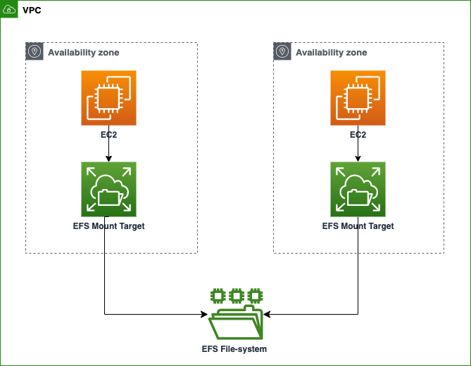

## Attach EFS to Multiple EC2 Instances using Terraform
Attach the AWS EFS filesystem to multiple AWS EC2 instances running on different AZs. To automate the whole process from creating an EFS filesystem to attaching it to the EC2 instances, we will use Terraform.



### Following are the steps we will follow to achieve our goal: 

1. Create an AWS VPC with two public subnets on two different AZs.

2. Create two Security Groups. one is for EC2 instances which will allow inbound SSH traffic on port 22, and another one is for EFS mount targets which will allow inbound traffic on port 2049 only from the EC2 instances security group. And both security groups will allow outbound traffic to any port from anywhere.

3. Create an EFS file system.

4. Configure EFS mount targets along with the security group created for EFS mount targets.

5. Generate a custom script that will help us mount EFS on EC2 instances.

6. Create AWS key pair so that we can SSH into the EC2 instances.

7. Deploy two EC2 instances on different subnets created on different AZs. While providing the EC2 instances execute the custom script we created for mounting EFS using terraform remote-exec provisioners.

### Test
To test whether the EFS file system is mounted on or not. `SSH` into the instances and run `df -k` command to find out all the mounted file systems on your EC2 instances.

<!-- ## Attach EFS volume to Multiple EC2 instances

```
#! /bin/bash
sudo yum update -y
sudo mkdir -p content/test/
sudo yum -y install amazon-efs-utils
#sudo su -c  "echo 'fs-02567aab704af0f76:/ content/test efs _netdev,tls,iam 0 0' >> /etc/fstab"
sudo su -c  "echo 'fs-02567aab704af0f76:/ content/test efs _netdev,tls 0 0' >> /etc/fstab"
sudo mount content/test/
df -k
```

```
file-system-id:/ efs-mount-point efs _netdev,tls,iam 0 0 

This appears to be an entry in the /etc/fstab file on a Linux system.

The entry specifies that the EFS (Elastic File System) should be mounted at a specific mount point (specified by "efs-mount-point"), with the file system ID being "file-system-id". The options specified for the mount include "_netdev" (which indicates that the filesystem is a network device and should not be mounted until the network is available), "tls" (which enables Transport Layer Security for data in transit), and "iam" (which enables the use of AWS Identity and Access Management (IAM) credentials for authentication).

The final "0 0" specifies the dump and file system check order options, respectively. A "0" for these options indicates that they should be skipped.
``` -->